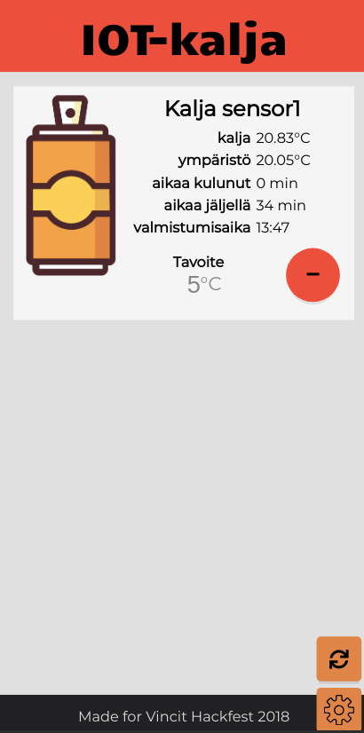

# IOT-kalja
IOT-kaljanlämpömittari web-applikaatio

Mittaa tölkin lämpötilaa mirkokontrollerissa kiinni olevan 
infrapunasensorin avulla ja lähettää sen palvelimelle JSONina.

Palvelin kerää sensorien tiedot ja laskee niistä koska kalja on tavoitelämpötilassa.

Web-pohjainen käyttöliittymä visualisoi palvelimen lähettämät tiedot ja mahdollistaa
tavoitelämpötilan muuttamisen.

